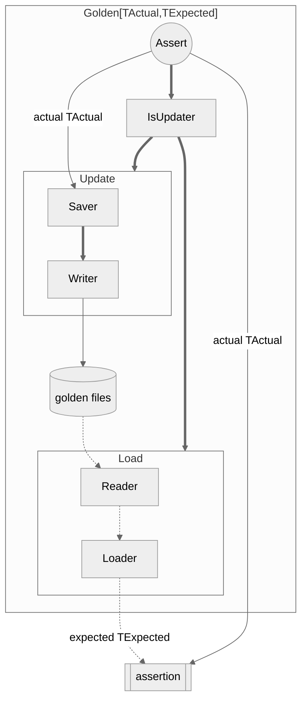

# Gilt
A library for performing Golden Tests in Go.

- Read and update golden files
- Use any assertion function

## Basic Usage
> [!TIP]
> See the [golden_examples_test.go](./golden_examples_test.go) for more examples.

### Reading and writing Golden files as strings

Test code:
```go
func hello(to string) string {
	return "Hello, " + to + "!"
}

func TestNewStringGolden(t *testing.T) {
	golden := gilt.NewStringGolden(t.Name())

	tests := []struct {
		name string
	}{
		{"world"},
		{"gopher"},
	}

	for _, tt := range tests {
		t.Run(tt.name, func(t *testing.T) {
			actual := hello(tt.name)
			golden.Assert(t, actual, tt.name, func(t *testing.T, actual string, expected string) {
				if actual != expected {
					t.Errorf("expected: %s\n, but was: %s", expected, actual)
				}
			})
		})
	}
}
```

Updating the golden file:

You can update the golden file by running the test with the `-update` flag.
```bash
$ go test -update
```

The following golden file will be generated:
```
testdata
└── testdata/TestNewStringGolden
    └── testdata/TestNewStringGolden/golden
        ├── testdata/TestNewStringGolden/golden/gopher.golden
        └── testdata/TestNewStringGolden/golden/world.golden
```

gopher.golden:
```
Hello, gopher!
```

Then you can run the test.
```bash
$ go test
```

### Reading and updating Golden files using json.Marshal/Unmarshal

Test code:
```go
type HelloMessage struct {
	Message string `json:"message"`
}

func helloMessage(to string) HelloMessage {
	return HelloMessage{"Hello, " + to + "!"}
}

func TestNewJSONGolden(t *testing.T) {
	golden := gilt.NewJSONGolden[HelloMessage, HelloMessage](t.Name())

	tests := []struct {
		name string
	}{
		{"world"},
		{"gopher"},
	}

	for _, tt := range tests {
		t.Run(tt.name, func(t *testing.T) {
			actual := helloMessage(tt.name)
			golden.Assert(t, actual, tt.name, func(t *testing.T, actual HelloMessage, expected HelloMessage) {
				if actual.Message != expected.Message {
					t.Errorf("expected: %v\n, but was: %v", expected, actual)
				}
			})
		})
	}
}
```

By running `go test -update`, the following golden file will be generated:
```
testdata
└── testdata/TestNewJSONGolden
    └── testdata/TestNewJSONGolden/golden
        ├── testdata/TestNewJSONGolden/golden/gopher.golden
        └── testdata/TestNewJSONGolden/golden/world.golden
```

gopher.golden:
```
{
  "message": "Hello, gopher!"
}
```

When running `go test`, the golden file will be unmarshaled into the `HelloMessage` type and passed to the assertion function.  
You can use any assertion function you like.
```go
	golden.Assert(t, actual, tt.name, func(t *testing.T, actual HelloMessage, expected HelloMessage) {
		if actual.Message != expected.Message {
			t.Errorf("expected: %v\n, but was: %v", expected, actual)
		}
	})
```

## Advanced Usage
### Customizing the reading and updating of Golden files
You can customize the reading and updating of Golden files by implementing the each of the following interfaces:



For example, you can specify a `gilt.SaveLines` function for `Saver` and a `gilt.LoadLines` function for `Loader` as follows:
```go
golden := gilt.New(
	t.Name(),
	gilt.WithSaver[[]string, iter.Seq[string]](
		gilt.SaverFunc[[]string](gilt.SaveLines[string]),
	),
	gilt.WithLoader[[]string](
		gilt.LoaderFunc[iter.Seq[string]](gilt.LoadLines),
	),
)
```

Of course, you can also specify a function that you have implemented yourself.